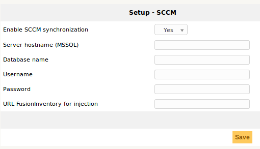

FR-Synchronisation des données avec l'outil Microsoft SCCM
===

Plugin permettant de synchroniser les ordinateurs présents dans SCCM (version 1802) avec GLPI (version 9.2).

Il utilise le serveur FusionInventory for GLPI et la puissance de son moteur interne.

# Principe de fonctionnement

* Le plugin intègre deux actions automatiques : "SCCMCollect" et "SCCMPush".

* L'action automatique "SCCMCollect" interroge le serveur SCCM au moyen de requêtes MsSQL.

* Cette même action construit un XML au format FusionInventory.

* L'action automatique "SCCMPush" injecte les fichiers XML en HTTP(s) (via cURL) pour faire appaître les ordinateurs dans GLPI.

De la même manière que le ferait un agent FusionInventory.

# Pré-requis

* Plugin FusionInventory for GLPI : https://github.com/fusioninventory/fusioninventory-for-glpi

* PHP *curl_init* : http://php.net/manual/fr/function.curl-init.php

* PHP *sqlsrv_connect* : http://php.net/manual/fr/function.sqlsrv-connect.php

* Microsoft System Center Configuration Manager : https://docs.microsoft.com/en-us/sccm/core/plan-design/changes/whats-new-in-version-1802

* Microsoft Drivers for PHP for Microsoft SQL Server : https://github.com/Microsoft/msphpsql

# Contribuer

* Respectez les [directives de développement](http://glpi-developer-documentation.readthedocs.io/en/master/plugins/index.html)

* Reportez-vous au processus [GitFlow](http://git-flow.readthedocs.io/fr/latest/) pour la gestion des branches

* Travaillez sur une nouvelle branche de votre fork

* Soumettez une PR qui sera analysé par un développeur

# Captures d'écran

Configurations du plugin (Configuration => Connecteur SCCM) :

Visualisation des actions automatiques (Configuration => Actions automatiques) :

# Nous contacter

Vous avez la possibilité de signaler un problème en suivant les instructions du fichier ISSUE_TEMPLATE.md.

Mais si vous souhaitez avoir de plus rapides résultats vous pouvez vous diriger vers le support professionnel.

N’hésitez pas à nous contacter à tout moment en sélectionnant le canal que vous préférez sur la page :

http://www.teclib-edition.com/fr/nous-contacter/

Un expert Teclib’ répondra à votre demande et vous fournira toutes les informations et conseils dont vous avez besoin sur: nos Produits, nos Programmes de Partenariat, nos Formations et nos Solutions d’assistance.

EN-Data synchronization with Microsoft SCCM tool
===

Plugin to synchronize computers from SCCM (version 1802) to GLPI (version 9.2).

It uses the "FusionInventory for GLPI" plugin and the power of its internal engine :

# Workflow

* The plugin integrates two automatic actions : "SCCMCollect" et "SCCMPush".

* The automatic action "SCCMCollect" queries the SCCM server with MsSQL queries.

* This same action builds an XML foreach computer (in FusionInventory format).

* The automatic action "SCCMPush" injects XML files into GLPI over HTTP(s) (via cURL and FusionInventory) to display computer in GLPI.

This is the same workflow that FusionInventory agent.

# Prerequisite

* FusionInventory for GLPI : https://github.com/fusioninventory/fusioninventory-for-glpi

* PHP *curl_init* : http://php.net/manual/en/function.curl-init.php

* PHP *sqlsrv_connect* : http://php.net/manual/en/function.sqlsrv-connect.php

* Microsoft System Center Configuration Manager : https://docs.microsoft.com/en-us/sccm/core/plan-design/changes/whats-new-in-version-1802

# Contributing

* Follow [development guidelines](http://glpi-developer-documentation.readthedocs.io/en/master/plugins/index.html)

* Refer to [GitFlow](http://git-flow.readthedocs.io/en/latest/) process for branching

* Work on a new branch on your own fork

* Open a PR that will be reviewed by a developer

# Screenshots

Plugin configurations (Setup => SCCM Connector) :

Displaying automatic actions (Setup => Automatic actions) :

# Contact us

You are able to raise community issues by following instructions in the ISSUE_TEMPLATE.md file.

But if you want faster results you can head to professional support.

Feel free to contact us at any time, selecting your preferred channel here:

http://www.teclib-edition.com/en/contact-us/

A Teclib’ expert will answer your request and provide you with all the information and advice you need about: our Products, Partnership Programs, Training Courses and Support solutions.

Licence for this plugin
===

GLPISCCMPlugin is free software; you can redistribute it and/or modify
it under the terms of the GNU General Public License as published by
the Free Software Foundation; either version 2 of the License, or
(at your option) any later version.

GLPISCCMPlugin is distributed in the hope that it will be useful,
but WITHOUT ANY WARRANTY; without even the implied warranty of
MERCHANTABILITY or FITNESS FOR A PARTICULAR PURPOSE.  See the
GNU General Public License for more details.

You should have received a copy of the GNU General Public License
along with GLPISCCMPlugin. If not, see <http://www.gnu.org/licenses/>.

Logo by @iconmonstr: http://iconmonstr.com/