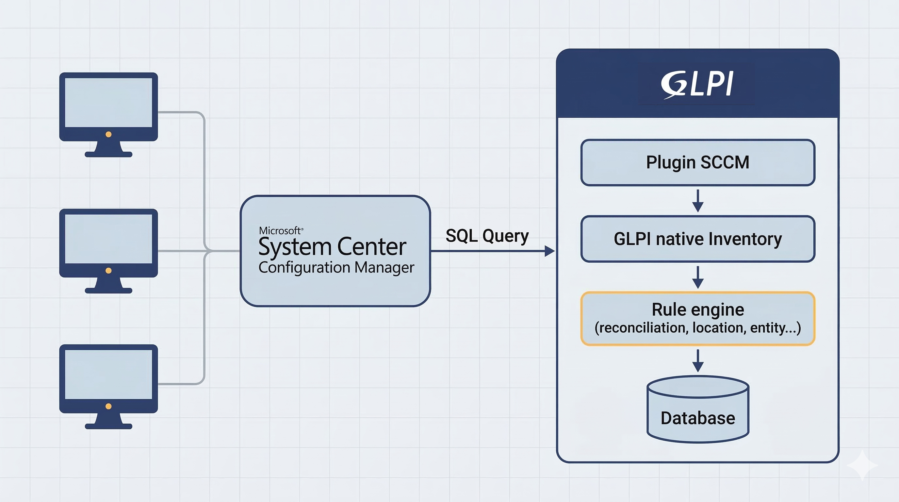

# SCCM Plugin For GLPI

  

## 📌 Overview

The **SCCM** plugin for GLPI allows automatic synchronization of computers managed by **Microsoft System Center Configuration Manager (SCCM)** with your GLPI inventory.

It works in **two main phases**:

1. **Collection**: Reads information from the SCCM database (via the `sqlsrv` PHP extension) and generates an XML file for each asset.
2. **Injection**: Sends these XML files to GLPI native inventory via `cURL`.

## ✅ Prerequisites

Before installing, ensure the following:

- PHP extension `sqlsrv`
  [Installation guide for Microsoft Drivers for PHP for SQL Server](https://learn.microsoft.com/fr-fr/sql/connect/php/installation-tutorial-linux-mac?view=sql-server-ver17)
- PHP extension `curl`

## ▶️ How It Works

The plugin automatically creates **two GLPI cron tasks** (Automatic Actions) during installation:

- **SCCMCollect** – Collects data and generates XMLs (default schedule: 04:00–05:00)
- **SCCMPush** – Sends XMLs to GLPI (`front/inventory.php`) (default schedule: 06:00–07:00)

You can manage these tasks under **Setup > Automatic actions**.

## 🧩 Synchronized Data

The plugin collects the following information from SCCM:

- System information: Machine, BIOS, CPU, RAM, Disks
- Network interfaces: IP / MAC addresses
- Installed software
- Users and sessions
- Hardware

## 📚 Documentation

Full plugin documentation is available [here](https://help.glpi-project.org/doc-plugins/plugins-glpi/sccm).

## 💼 Professional Services

GLPI professional services are offered through the [Partner Network](http://www.teclib-edition.com/en/partners/):

- Specialized training
- Bug fixes with an editor subscription
- Contributions for new features
- Personalized support and consulting

Experience a tailored service with exclusive advantages and opportunities.

## 🤝 Contributing

We welcome contributions! Here's how you can help:

- Report bugs or request features via [Issues](https://github.com/pluginsGLPI/sccm/issues)
- Follow the [development guidelines](http://glpi-developer-documentation.readthedocs.io/en/latest/plugins/index.html)
- Use [GitFlow](http://git-flow.readthedocs.io/) for branching
- Work on a new branch in your fork
- Submit a Pull Request (PR) for review

## 🚀 About

## 📣 Connect with GLPI

